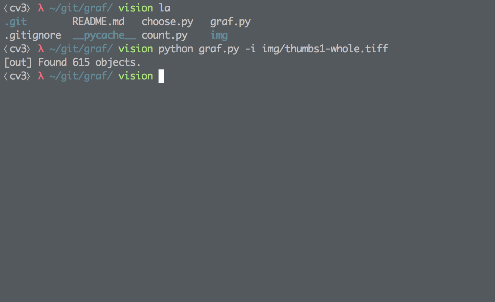
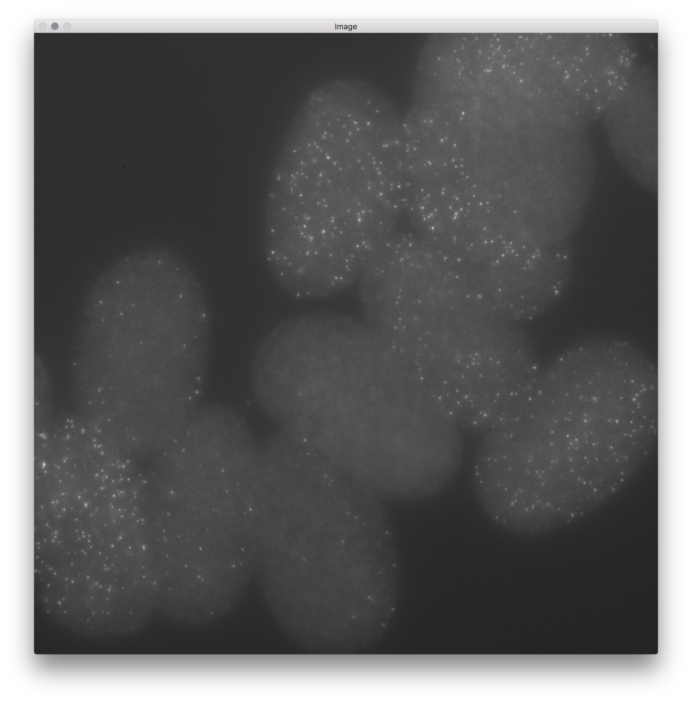
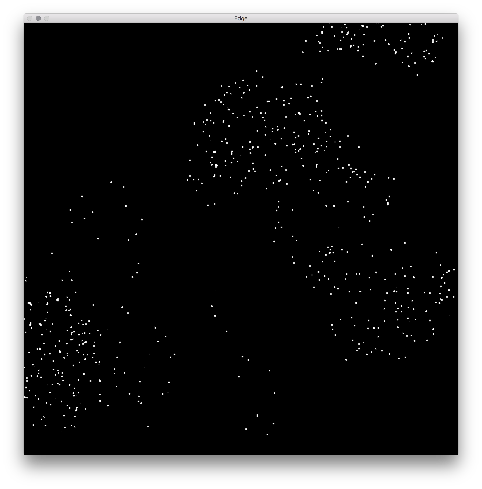
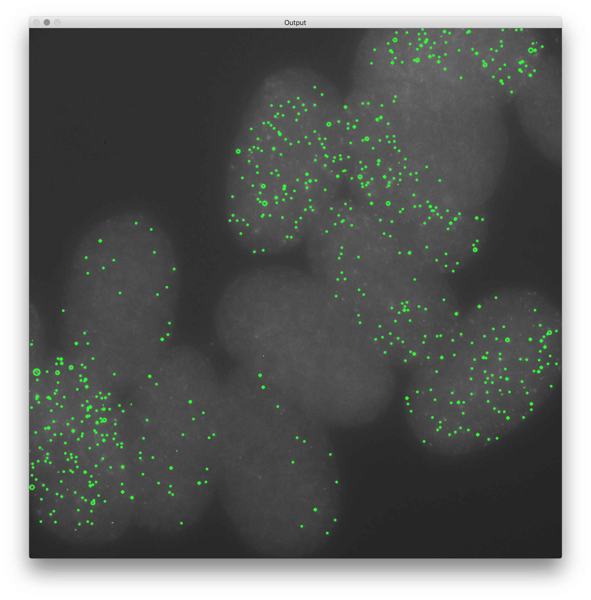

# GRAF

## Introduction

This is **``graf``**, software for counting cells in FISH microscopy images. **``graf``** uses neural network techniques such as convolutional/deconvolutional neural networks along with recurrent neural networks to identify/count single molecule mRNA in 3D images produced via FISH microscopy. This method is designed to reduce the number of training examples required.

## Usage

Currently, **``graf``** is in early development stages and cannot be used. In future, usage of **``graf``** will likely require TensorFlow.

```
(Historical) Usage:
    python graf.py (-i | --image <path/to/image>)
```
Prior to the switch to neural networks being implemented, **``graf``** could take images as input and highlight the spots in them using the above command. Examples of this are shown below. Note that currently, this is **not** possible to do in Graf!

### Screenshots





The above images show the output in both the terminal (which shows the counted number of cells) as well as the OpenCV image visualizations that depict the cells detected by **``graf``** and highlight their positions on the image. This example image of *C. elegans* embryos was taken from [Rifkin Labs](http://labs.biology.ucsd.edu/rifkin/software.html) and all rights to the image belong to them as specified.
